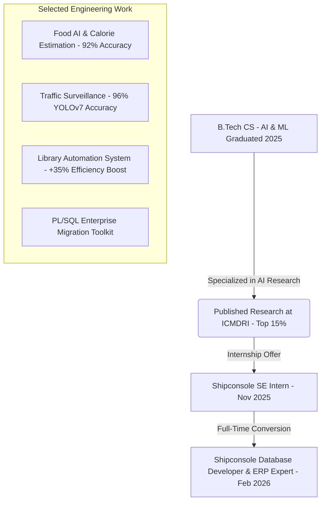

# 🚀 Saiteja Athmakuri — Professional Portfolio & Architecture Documentation

Welcome to the official technical documentation and developer guide for **Saiteja Athmakuri's Developer Portfolio**. This document serves a dual purpose: detailing Saiteja's professional profile as an enterprise **Database Engineer & Full Stack Developer**, and explaining the technical architecture, custom design system, and interactive features built into this modern web application.

---

## 👨‍💻 Part 1: About Saiteja Athmakuri

### Executive Summary
**Saiteja Athmakuri** is a results-driven **Database Engineer, ERP Expert, and Full Stack Developer** based in Hyderabad, India. Specializing in high-volume enterprise transactions, cloud migrations, and intelligent AI/ML pipelines, Saiteja combines rigorous backend architecture with modern frontend web design.

He currently drives enterprise cloud migrations at **Shipconsole**, transitioning mission-critical on-premise ERP infrastructures to scalable AWS Cloud and SaaS environments.

> [!IMPORTANT]
> **Current Status**: Working as a Database Developer & ERP Expert at Shipconsole (Feb 2026 – Present). Converted from a Software Engineering Internship based on exceptional PL/SQL & AWS cloud performance!

---

### 🛠️ Core Technical Specializations

| Domain | Technologies & Skills | Proficiency & Highlights |
| :--- | :--- | :--- |
| **Database Engineering** | SQL, PL/SQL, Oracle, MySQL, JDBC, Cursors, Triggers | **92% Proficiency** • Automated data cleansing & zero-downtime AWS RDS migrations |
| **Full Stack Development** | Java, Spring Boot, Object-Oriented Programming, REST APIs | **88% Proficiency** • Microservices architecture & enterprise automation |
| **Cloud & DevOps** | AWS (RDS, EC2), Docker, Git, ServiceNow, CI/CD Pipelines | Cloud-first infrastructure architecture & SaaS deployments |
| **Frontend Web** | HTML5, CSS3, JavaScript, TypeScript, Angular, Tailwind CSS | Glassmorphic UI, responsive layouts, 60 FPS HTML5 Canvas animations |
| **AI & Data Science** | Python, TensorFlow, OpenCV, MobileNetV2, YOLOv7, Power BI | CNN computer vision, multi-class classification, interactive dashboards |

---

### 🏆 Key Career Milestones & Engineering Projects



1. **Enterprise PL/SQL & Cloud Migration Toolkit (Shipconsole)**:
   - Automated schema mapping, data cleansing, and zero-downtime migration of on-premise Oracle ERP databases to AWS RDS.
2. **Food AI & Real-Time Calorie Estimation (ICMDRI Research Honor — Top 15%)**:
   - Engineered a deep learning CNN model using MobileNetV2 transfer learning, achieving **92% classification accuracy** across multi-class food recognition.
3. **Real-Time Traffic Surveillance Pipeline**:
   - Built a vehicle tracking system using YOLOv7 and OpenCV with **96% detection accuracy**, implementing multithreading for a **30% execution speed boost**.
4. **Enterprise Library Management System**:
   - Developed a Java & MySQL automated library engine that improved operational fine calculation and book tracking efficiency by **35%**.

---

### 🎓 Academic Foundation & Verified Credentials
* **Education**: Bachelor of Technology (B.Tech) in Computer Science (AI & ML) — *Siddhartha Institute of Technology & Science* (Graduated 2025).
* **Certifications**:
  * ☁️ **AWS Cloud Essentials** — Amazon Web Services
  * 🤖 **IBM SkillsBuild AI** — IBM
  * ☕ **Java Programming Specialization** — Great Learning
  * ⚡ **ServiceNow Micro-Certification** — Welcome to ServiceNow
  * 🗄️ **Oracle SQL Fundamentals** — Cognitive Class

---

## 🎨 Part 2: Portfolio Technical Architecture & "Ameya Jarvis" Design System

This web application is engineered with **Angular 18+**, **TypeScript**, and **Tailwind CSS**, designed from the ground up to replicate the award-winning **Ameya Jarvis Warm Dark Oat** aesthetic.

### 🌟 1. The Warm Dark Oat & Olive Green Color Palette
Unlike standard generic web themes, this portfolio utilizes a curated, state-of-the-art color system:
* **Dark Mode (`#0e0b09` / `#16120e`)**: Deep, warm oat black backgrounds paired with rich glassmorphic surface panels (`#14110d/80`).
* **Light Mode (`#faf6f0` / `#f0e6da`)**: Clean cream and golden oat surfaces providing high contrast and elegance.
* **Glowing Olive Green Accent (`#8bab2a` / `#415b06`)**: Used for interactive highlights, skill bars, badges, and glowing borders.

---

### ✍️ 2. Editorial Cursive & Modern Typography
* **Editorial Cursive Serif (`Playfair Display` & `Bodoni Moda`)**: The brand name `Saiteja Athmakuri` in the Hero and About sections renders in a luxurious editorial cursive script, giving a premium, high-end magazine feel.
* **Sora Font**: Clean, modern sans-serif used for all descriptions, navigation links, and body copy.
* **JetBrains Mono**: Monospace font used for data metrics (`4+`, `92%`), timestamps, and technical tags.

---

### 🌌 3. Ultra-Dense Pinprick Star Field (`StarFieldComponent`)
To replicate the exact starry sky from the reference picture, a standalone HTML5 `<canvas>` animation component (`src/app/components/star-field/`) runs in the background:
* **350 Ultra-Tiny Stars**: Renders exactly **350 tiny pinprick dots and pixel squares** ranging from `0.4px` to `1.2px` in size.
* **Theme-Responsive Colors**:
  * In Dark Mode: Crisp white, warm cream, and golden oat pinpricks.
  * In Light Mode: Deep olive and golden bark specks.
* **Silky Smooth 60 FPS**: Uses `requestAnimationFrame` with gentle upward drift (`vy: -0.05` to `-0.3`) and dynamic twinkling opacities.

---

### 📍 4. Interactive OpenStreetMap Card (Hyderabad GMT+5:30)
In the About Me section, an interactive live embedded map card displays Saiteja's exact professional base:
* Embedded directly via **OpenStreetMap** iframe with custom grayscale and contrast styling.
* Features floating badges for **`HYDERABAD`** and **`GMT+5:30 Timezone`**, replicating the reference map cards.

---

### ✨ 5. Built-In Interactive AI Assistant Chatbot (`AiAssistantComponent`)
Located at the bottom right (`src/app/components/ai-assistant/`), this interactive chatbot widget serves as an instant knowledge base for recruiters and engineering peers:
* **Modern AI Sparkle Star Core Icon**: Features an ultra-sleek rotating AI sparkle star cluster (`✨`) with an emerald online indicator and custom hover tooltip (`Ask AI about Saiteja ✨`).
* **Interactive Knowledge Engine**: Instantly answers natural language queries regarding Saiteja's Shipconsole ERP experience, PL/SQL skills, 92% food AI research, certifications, and contact details.
* **Quick Suggested Prompt Pills**: Visitors can click pre-built buttons (`👤 Who is the Owner?`, `💼 Shipconsole ERP Role`, `🛠️ Technical Skills`, `📧 Contact & Hire`) for instant, formatted answers.

---

## 💻 Part 3: Developer & Deployment Guide

### Project File Structure
```text
saiteja-portfolio/
├── src/
│   ├── index.html                  # Google Fonts (Sora, JetBrains Mono, Playfair Cursive)
│   ├── styles.scss                 # Ameya Jarvis Warm Dark Oat variables & custom scrollbar
│   └── app/
│       ├── app.component.ts        # Minimalist top header nav & main layout wrapper
│       └── components/
│           ├── hero/               # 2-column layout with cursive name & interactive highlights card
│           ├── about/              # Profile, Technical Focus & Hyderabad OpenStreetMap card
│           ├── projects/           # Featured Projects 3-column grid & GitHub button
│           ├── experience/         # Career path & Shipconsole milestones
│           ├── contact/            # Ameya Jarvis contact cards (LinkedIn, Email, Phone, Location)
│           ├── star-field/         # 350 ultra-tiny pinprick HTML5 Canvas background
│           └── ai-assistant/       # Interactive bottom-right portfolio knowledge chatbot
├── tailwind.config.js              # Theme customization & font families
└── package.json
```

### Running Locally
To launch the development server and open the live site in your browser:
```bash
# Install dependencies (if not already installed)
npm install

# Start development server and open default browser
npm start -- -o
```
Navigate to `http://localhost:4200/`. The app will automatically reload if you change any source files.

### Building for Production
To generate a production-ready bundle optimized with tree-shaking and minification:
```bash
npm run build
```
The build artifacts will be stored in the `dist/example-app/` directory, ready to be deployed to GitHub Pages, Vercel, AWS S3, or Firebase Hosting.

---
*Documentation generated for Saiteja Athmakuri &bull; All rights reserved &copy; 2026.*
